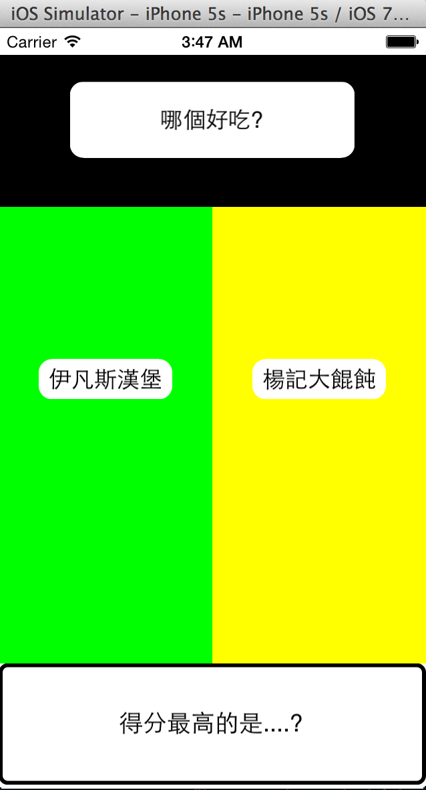

# Cruel 1 in 2 
殘酷二選一，到底是 A 還是 B ?!

小玩 Swift 的玩具 App，開啟會下載一份 json 檔 (該網址可以自己設定，schema 符合即可)
根據 json 所提供的問題以及答案集合，每次跳出兩個選擇，只能選擇其中一個!
選擇次數最多者將會是最終選擇!

另外 Library 有兩個是 objective-c 寫的，  
透過邪門歪道(XD)把它 bridge 起來就可以給 swift 用了!!

Used third-party lib:  
    1. [Reachability](https://github.com/tonymillion/Reachability)  
    2. [MBProgressHUD](https://github.com/jdg/MBProgressHUD)  
    3. [SwiftyJSON](https://github.com/lingoer/SwiftyJSON)  